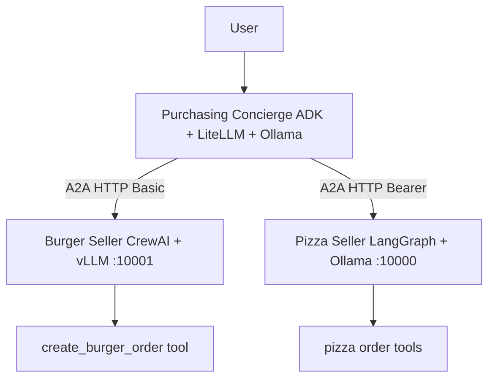

# Multi-Agent AI Purchasing System

### Cross-framework Agent-to-Agent demo: Google ADK concierge routes to CrewAI/vLLM and LangGraph/Ollama sellers

[](https://github.com/ArchanaChetan07/Multi-Agent-AI-Purchasing-System-with-Google-ADK-AMD-Instinct-GPUs/actions/workflows/ci.yml)
[](https://www.python.org/)
[](tests/)
[](agents/)

Demonstrates **Agent-to-Agent (A2A)** interoperability across three different agent stacks on **local AMD Instinct–class GPUs**: a Google **ADK** purchasing concierge (LiteLLM → Ollama) delegates food orders to a **CrewAI** burger seller backed by **vLLM** and a **LangGraph** pizza seller on Ollama. Includes Gradio UI, per-agent auth (Basic vs Bearer), and offline pytest coverage — no cloud API required when local models are running.

---

## Key Results

| Metric | Value | Source |
|---|---|---|
| Agent services | **3** (purchasing, burger, pizza) | `agents/` |
| Frameworks | **Google ADK, CrewAI, LangGraph** | `requirements.txt`, `docs/ARCHITECTURE.md` |
| LLM backends | **vLLM (burger) + Ollama (pizza + root)** | `scripts/start_vllm.sh`, `scripts/start_ollama.sh` |
| Python modules | **20** | git tree |
| Unit tests | **16** | `tests/test_*_agent.py` |
| UI | Gradio purchasing app | `agents/purchasing_agent/app.py` |
| A2A ports | Burger **:10001**, Pizza **:10000** | `docs/ARCHITECTURE.md` |

---

## Architecture



**How it works:** the root ADK agent parses a natural-language food request, discovers seller agents over HTTP A2A, and forwards sub-tasks. Burger CrewAI uses OpenAI-compatible vLLM tool-calling; Pizza LangGraph runs quantized GGUF models via Ollama. Memory is split by setting vLLM `--gpu-memory-utilization 0.6`.

---

## Tech Stack

| Layer | Choice |
|---|---|
| Root agent | `google-adk`, LiteLLM, Ollama |
| Burger agent | CrewAI, vLLM (Llama 3.1 chat template) |
| Pizza agent | LangGraph, langchain-ollama |
| Protocol | Google A2A HTTP between agents |
| UI | Gradio |
| Auth | Basic (burger), Bearer (pizza) |
| Tests | pytest, pytest-asyncio |

---

## Features

- Three-framework interoperability through a shared A2A contract
- Local-only inference path (vLLM + Ollama) for AMD GPU setups
- Tool-based order creation with structured `Order` responses
- Startup scripts for vLLM, Ollama, and all agents (`scripts/start_all.sh`)
- AMD GPU setup guide in `docs/AMD_GPU_SETUP.md`

---

## Installation & Usage

```bash
git clone https://github.com/ArchanaChetan07/Multi-Agent-AI-Purchasing-System-with-Google-ADK-AMD-Instinct-GPUs.git
cd Multi-Agent-AI-Purchasing-System-with-Google-ADK-AMD-Instinct-GPUs
pip install -r requirements.txt
cp .env.example .env
```

```bash
# Start local LLMs + agents (requires AMD GPU + ROCm stack)
./scripts/start_all.sh

# Offline unit tests (mocked agents)
pytest -q

# Gradio UI
python agents/purchasing_agent/app.py
```

---

## Project Structure

```text
Multi-Agent-AI-Purchasing-System-with-Google-ADK-AMD-Instinct-GPUs/
├── agents/
│   ├── purchasing_agent/    # Google ADK root + Gradio
│   ├── burger_agent/      # CrewAI + vLLM
│   └── pizza_agent/       # LangGraph + Ollama
├── scripts/               # start_vllm, start_ollama, start_all
├── tests/                 # 16 pytest tests
└── docs/                  # ARCHITECTURE, A2A_PROTOCOL, AMD_GPU_SETUP
```

---

## License

See repository license file if present.
