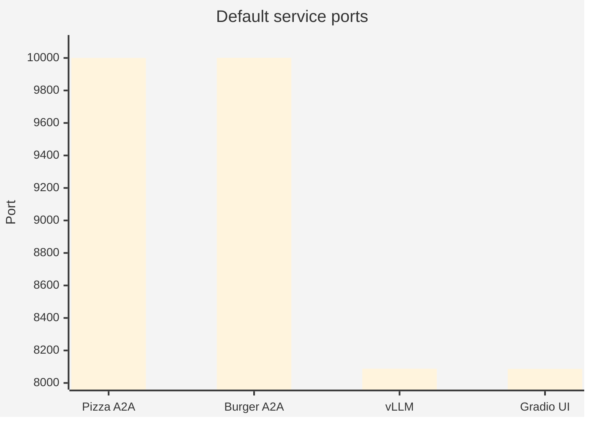
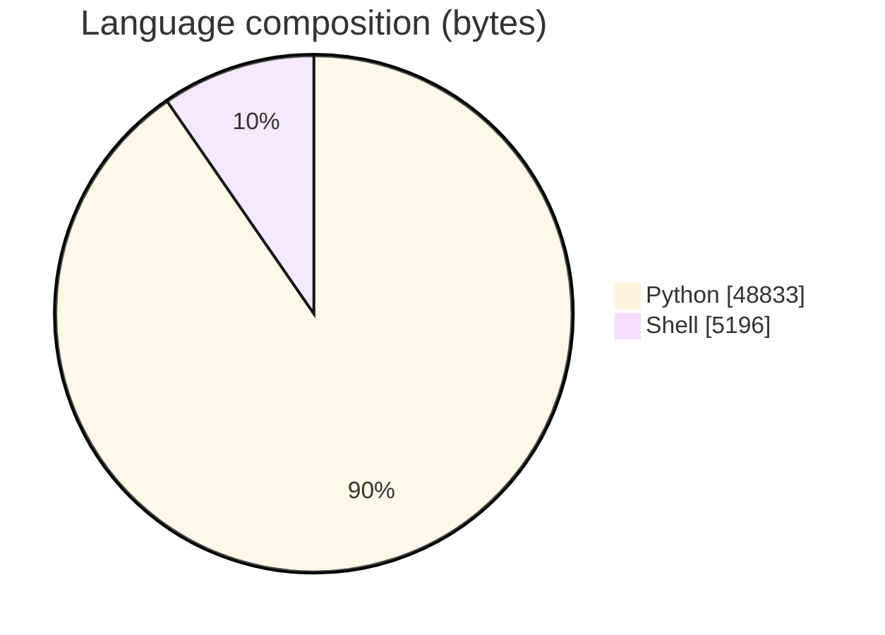
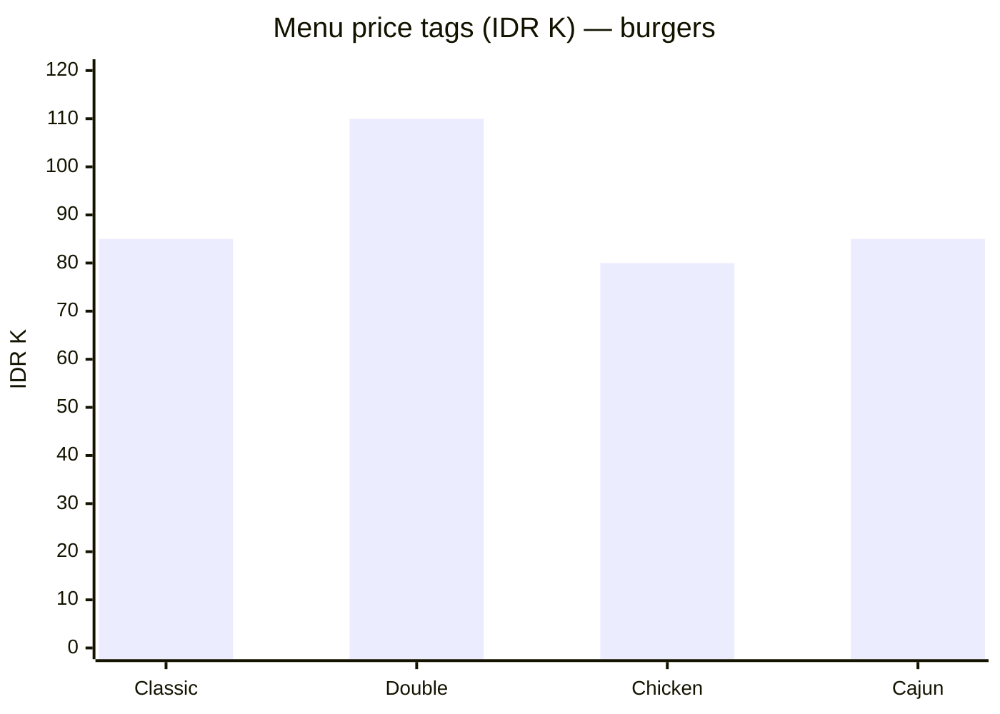
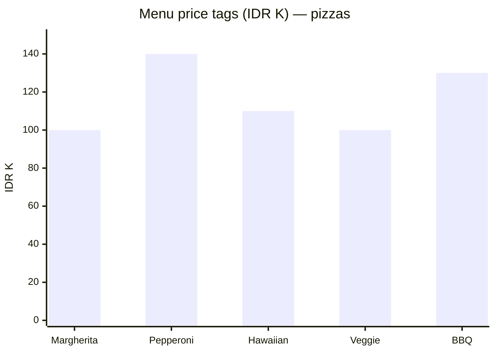
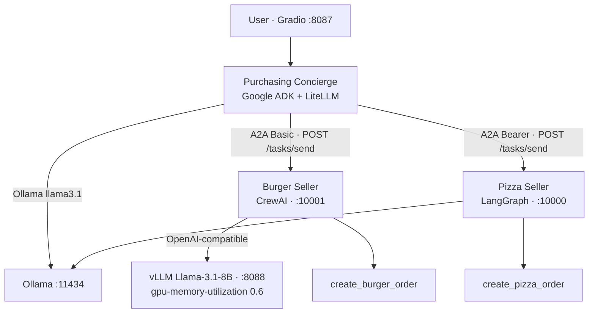
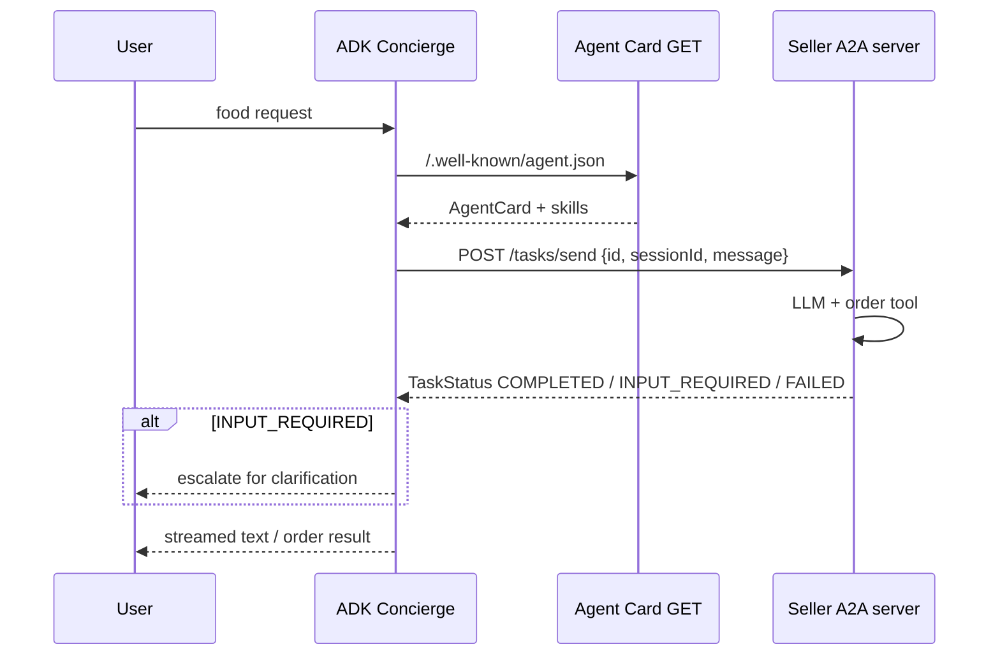
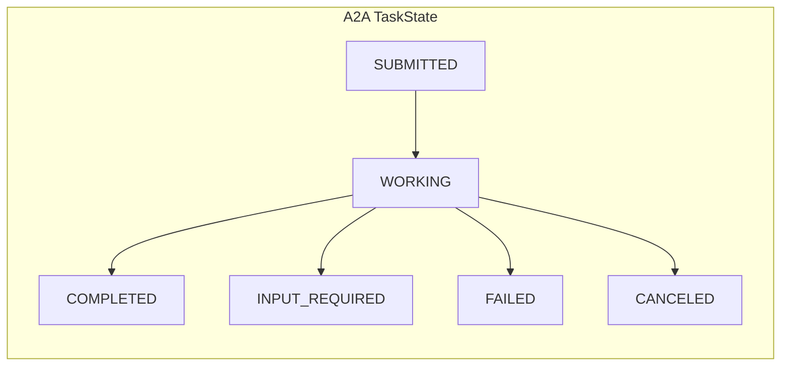
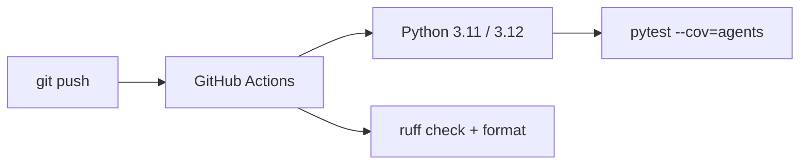

# Multi-Agent AI Purchasing System

### Cross-framework **Agent-to-Agent (A2A)** commerce demo — **Google ADK** concierge · **CrewAI** burger seller (**vLLM**) · **LangGraph** pizza seller (**Ollama**) on **AMD Instinct** GPUs

<p align="center">
  
  
  
  
  
</p>

<p align="center">
  
  
  
  
  
</p>

---

## Overview

Prove that **heterogeneous agent frameworks** can collaborate on a purchasing task through Google’s open **[A2A protocol](https://github.com/google/a2a)** — with **100% local Llama 3.1** inference on AMD GPUs (no cloud model APIs required for the demo path).

| Agent | Framework | LLM backend | Port | Auth |
|-------|-----------|-------------|------|------|
| **Purchasing Concierge** (root) | **Google ADK** + LiteLLM | **Ollama** `llama3.1` | Gradio UI **8087** | — |
| **Burger Seller** | **CrewAI** | **vLLM** OpenAI-compatible · Llama 3.1-8B | **10001** | **HTTP Basic** |
| **Pizza Seller** | **LangGraph** ReAct + MemorySaver | **Ollama** | **10000** | **Bearer** |

vLLM OpenAI base defaults to **`http://localhost:8088/v1`** with `--gpu-memory-utilization **0.6**` so Ollama can share the Instinct GPU.

Portfolio signal for **agentic systems / multi-agent orchestration / on-prem LLM serving**: A2A discovery + task lifecycle, dual auth schemes, tool-calling, and AMD/ROCm ops docs.

> Numbers below come from committed configs, menus, scripts, and tests. **No Instinct latency/throughput leaderboard is published in-repo** — do not invent one.

---

## Results & repository facts (traceable)

### Topology defaults

| Fact | Value | Source |
|------|--------|--------|
| Agents | **3** (ADK · CrewAI · LangGraph) | `docs/ARCHITECTURE.md` |
| Seller ports | Pizza **10000** · Burger **10001** | agent configs |
| vLLM serve port | **8088** | `scripts/start_vllm.sh` |
| Gradio UI port | **8087** | `.env.example` / `app.py` |
| vLLM GPU mem util | **0.6** (40% headroom for Ollama) | `start_vllm.sh` |
| Default models | `meta-llama/Llama-3.1-8B-Instruct` (vLLM) · `llama3.1:latest` (Ollama) | configs |
| Package | **`adk-multi-agent-system` v1.0.0** · MIT · Python **≥3.11** | `pyproject.toml` |
| Tracked files | **34** | git tree |
| Languages | Python **48,833** B · Shell **5,196** B | GitHub API |
| pytest | **16** cases (burger **6** · pizza **5** · purchasing **5**) | `tests/` |
| CI matrix | Python **3.11** + **3.12** · ruff · coverage | `.github/workflows/ci.yml` |





### Menu catalogs (committed pricing in IDR ×1000)

| Burger menu (4 items) | Price | Pizza menu (5 items) | Price |
|-----------------------|------:|----------------------|------:|
| Classic Cheeseburger | **85** | Margherita | **100** |
| Double Cheeseburger | **110** | Pepperoni | **140** |
| Spicy Chicken Burger | **80** | Hawaiian | **110** |
| Spicy Cajun Burger | **85** | Veggie | **100** |
| | | BBQ Chicken | **130** |





### Session state keys (ADK)

| Key | Type | Purpose |
|-----|------|---------|
| `session_id` | UUID str | Correlation across remote A2A tasks |
| `session_active` | bool | Seller task in flight |
| `active_agent` | str | Currently engaged seller |

### AMD hardware matrix (documented)

| GPU | VRAM | Notes |
|-----|------|-------|
| **MI250X** | 2×64 GB HBM2e | Recommended dual-model |
| **MI300X** | 192 GB HBM3 | Large-model headroom |
| **MI210** | 64 GB HBM2e | Supported |
| RX 7900 XTX | 24 GB | Consumer · reduced headroom |

### Explicitly not claimed

- No checked-in end-to-end order latency / tokens-sec on Instinct  
- Demo auth secrets in `.env.example` are **placeholders** — replace before any network exposure  

---

## Architecture







Deep dives: [`docs/ARCHITECTURE.md`](docs/ARCHITECTURE.md) · [`docs/A2A_PROTOCOL.md`](docs/A2A_PROTOCOL.md) · [`docs/AMD_GPU_SETUP.md`](docs/AMD_GPU_SETUP.md)

---

## Why this design

| Choice | Rationale (from docs) |
|--------|------------------------|
| Three frameworks | Demonstrate **A2A interoperability**, not vendor lock-in |
| vLLM for burger | CrewAI needs OpenAI-style **tool calling** + Llama 3.1 JSON chat template |
| Ollama for pizza + root | Lighter / GGUF; shares Instinct with vLLM at **0.6** GPU mem util |
| Basic vs Bearer | Auth-agnostic A2A — each seller enforces its own scheme |
| JWKS push path | Both sellers expose `/.well-known/jwks.json` for signed push notifications |

---

## Repository layout

```text
Multi-Agent-AI-Purchasing-System-with-Google-ADK-AMD-Instinct-GPUs/
├── agents/
│   ├── purchasing_agent/   # ADK root + Gradio app + A2A connections
│   ├── burger_agent/       # CrewAI + Basic-auth A2A server :10001
│   └── pizza_agent/        # LangGraph + Bearer A2A server :10000
├── docs/{ARCHITECTURE,A2A_PROTOCOL,AMD_GPU_SETUP}.md
├── scripts/{start_all,start_vllm,start_ollama}.sh
├── tests/                  # 16 pytest cases
├── utils/                  # A2A client/server helpers
├── requirements.txt · pyproject.toml · .env.example
└── .github/workflows/ci.yml
```

---

## Quickstart

```bash
git clone https://github.com/ArchanaChetan07/Multi-Agent-AI-Purchasing-System-with-Google-ADK-AMD-Instinct-GPUs.git
cd Multi-Agent-AI-Purchasing-System-with-Google-ADK-AMD-Instinct-GPUs

python -m venv .venv && source .venv/bin/activate   # Win: .\.venv\Scripts\Activate.ps1
pip install -r requirements.txt
cp .env.example .env   # set HF_TOKEN; rotate demo passwords

# AMD / ROCm host with vLLM + Ollama installed:
export HF_TOKEN=...
bash scripts/start_all.sh
# UI → http://localhost:8087

pytest tests/ -v
```

Standalone backends: `scripts/start_vllm.sh` · `scripts/start_ollama.sh`.

---

## Testing & CI

| Suite | Focus |
|-------|--------|
| `test_burger_agent.py` | Order tool · TaskState mapping · fallback |
| `test_pizza_agent.py` | Order tool · INPUT_REQUIRED / COMPLETED mapping |
| `test_purchasing_agent.py` | Text parts · Agent Card resolve / skip unreachable |
| Actions | Matrix **3.11/3.12** · pytest-cov · ruff check/format |



---

## Tech stack & keywords

| Layer | Technology |
|-------|------------|
| Orchestration | **Google ADK**, Gradio UI |
| Seller agents | **CrewAI**, **LangGraph** / LangChain |
| Inference | **vLLM** (ROCm), **Ollama**, **LiteLLM** |
| Protocol | **A2A** HTTP · Agent Cards · TaskStatus |
| Security | Basic · Bearer · JWKS / python-jose |
| Hardware docs | **AMD Instinct** MI210 / MI250X / MI300X · ROCm 6.x |
| Quality | pytest · asyncio · ruff · GitHub Actions |

**Keyword surface:** Python · multi-agent · agentic AI · Google ADK · A2A protocol · CrewAI · LangGraph · vLLM · Ollama · Llama 3.1 · AMD Instinct · ROCm · tool calling · Gradio · local LLM · distributed agents · pytest · CI/CD

---

## Roadmap

- Capture measured TTFT / order E2E latency on Instinct and commit JSON evidence  
- Remove stray root `Null` artifact  
- HTTPS termination + production secret management for seller auth  

---

<p align="center">
  <b>Multi-Agent AI Purchasing System</b> · MIT · v1.0.0<br/>
  <a href="https://github.com/ArchanaChetan07/Multi-Agent-AI-Purchasing-System-with-Google-ADK-AMD-Instinct-GPUs">github.com/ArchanaChetan07/Multi-Agent-AI-Purchasing-System-with-Google-ADK-AMD-Instinct-GPUs</a>
</p>
