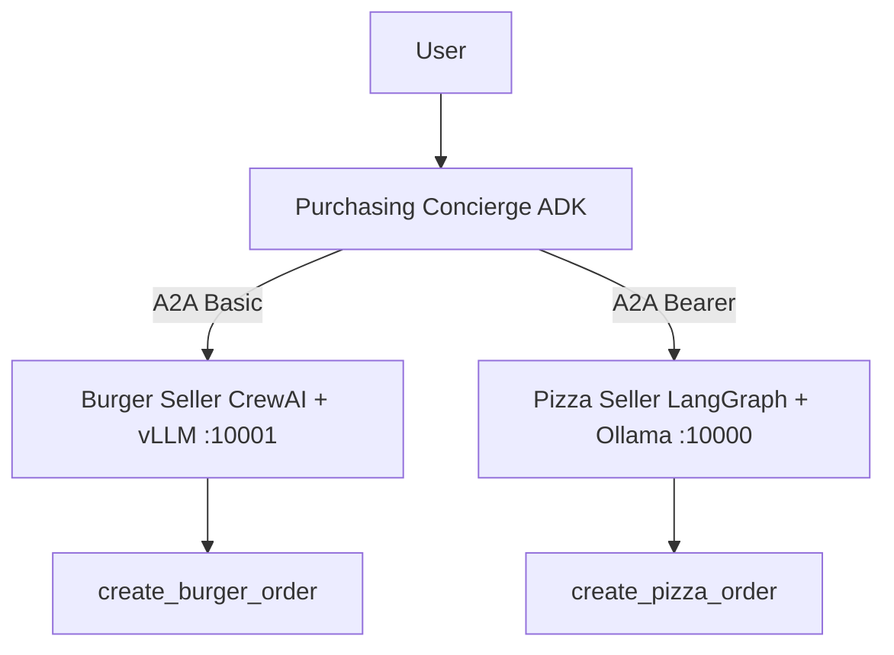
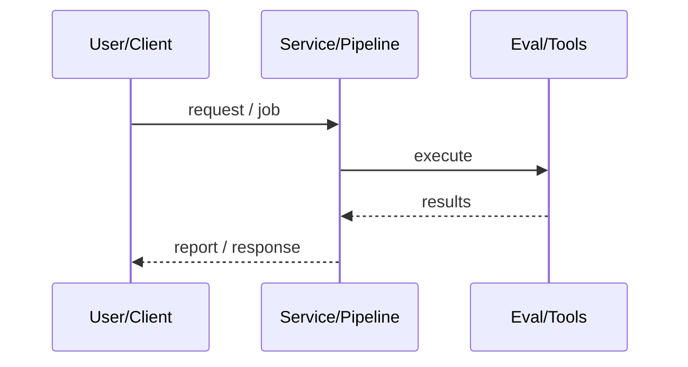
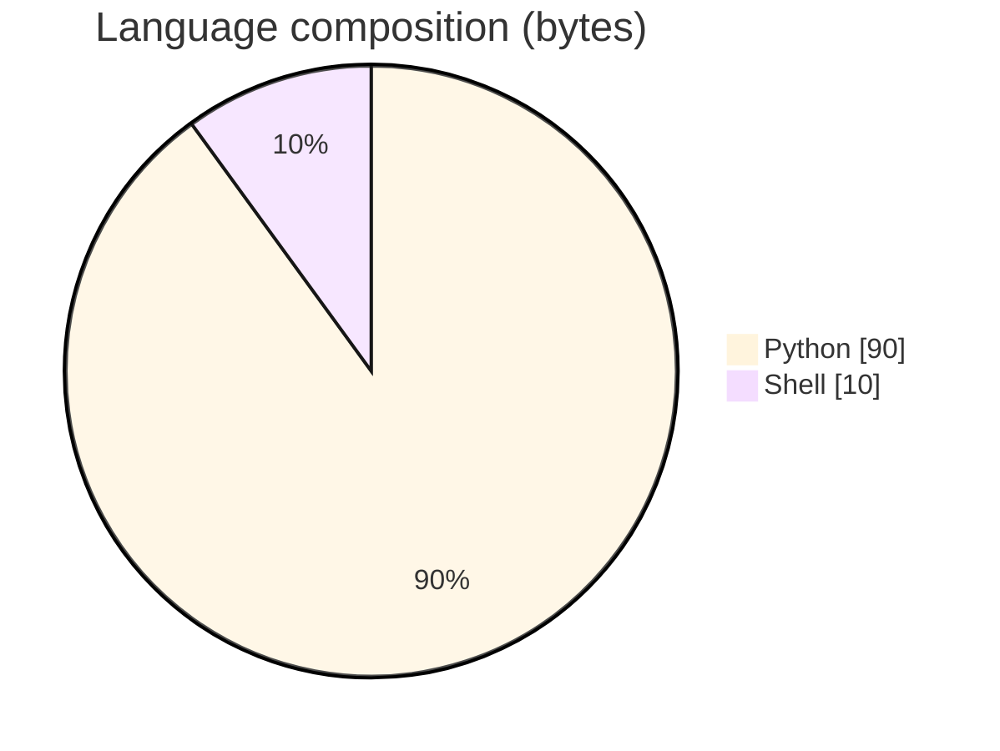

# Multi-Agent Purchasing System (Google ADK · A2A · AMD GPUs)

### Cross-framework A2A purchasing demo: Google ADK concierge + CrewAI burger seller (vLLM) + LangGraph pizza seller (Ollama) on AMD Instinct.

[](https://github.com/ArchanaChetan07/Multi-Agent-AI-Purchasing-System-with-Google-ADK-AMD-Instinct-GPUs)
[](https://github.com/ArchanaChetan07/Multi-Agent-AI-Purchasing-System-with-Google-ADK-AMD-Instinct-GPUs)
[](https://github.com/ArchanaChetan07/Multi-Agent-AI-Purchasing-System-with-Google-ADK-AMD-Instinct-GPUs)
[](https://github.com/ArchanaChetan07/Multi-Agent-AI-Purchasing-System-with-Google-ADK-AMD-Instinct-GPUs/actions)

---

## Overview

Show that heterogeneous agent frameworks can collaborate on a purchasing task via the open Agent-to-Agent protocol with local GPU inference.

Purchasing root agent (ADK + LiteLLM/Ollama) routes over A2A HTTP to burger (CrewAI→vLLM, Basic auth :10001) and pizza (LangGraph→Ollama, Bearer :10000); docs for AMD GPU, architecture, start scripts; pytest per agent.

Documented three-agent local inference topology with order tools and CI tests; designed for 100% local models on AMD Instinct.

This repository is maintained as **production-minded portfolio work**: clear architecture, automated checks where present, and metrics that are **traceable to committed artifacts** (never invented).

---

## Architecture

User → ADK Purchasing Concierge → A2A HTTP → Burger CrewAI/vLLM & Pizza LangGraph/Ollama → order tools → TaskStatus responses





---

## Results & repository facts

> Only values found in code, configs, tests, or generated reports are listed. Absence of a clinical/ML accuracy number means it was **not** published in-repo.

| Metric | Value | Source |
|---|---|---|
| Tracked blobs on main | **34** | `git tree main` |
| Seller agent ports | **10000 (pizza), 10001 (burger)** | `docs/ARCHITECTURE.md` |
| Tracked files | **34** | `git tree` |
| Python modules | **20** | `git tree` |
| Test-related paths | **4** | `git tree` |
| CI workflows | **Yes** | `.github/workflows` |
| Docker present | **No** | `repo root` |



---

## Key features

- Cross-framework interoperability via A2A
- Separate auth schemes per seller agent
- Menu/order tools for burger and pizza agents
- AMD GPU setup + start_all/vllm/ollama scripts
- Architecture and A2A protocol docs
- Per-agent unit tests

---

## Tech stack

| Layer | Technology |
|---|---|
| language | Python |
| agents | Google ADK / CrewAI / LangGraph |
| serving | vLLM + Ollama |
| protocol | A2A HTTP |
| hardware | AMD Instinct GPUs |
| ci | pytest + GitHub Actions |

---

## Skills demonstrated

Python · Google ADK · CrewAI · LangGraph · vLLM · Ollama · LiteLLM · CI/CD · testing · automation

Keyword surface: **Python · Python · machine-learning · CI/CD · testing · API · Docker · automation · data-science · software-engineering · system-design · observability · LLM · cloud**

---

## Project structure

```text
Multi-Agent-AI-Purchasing-System-with-Google-ADK-AMD-Instinct-GPUs/
├── agents/{purchasing_agent,burger_agent,pizza_agent}/
├── docs/{ARCHITECTURE,A2A_PROTOCOL,AMD_GPU_SETUP}.md
├── scripts/start_*.sh
├── tests/
└── requirements.txt
```

---

## Installation & usage

```bash
git clone https://github.com/ArchanaChetan07/Multi-Agent-AI-Purchasing-System-with-Google-ADK-AMD-Instinct-GPUs.git
cd Multi-Agent-AI-Purchasing-System-with-Google-ADK-AMD-Instinct-GPUs
pip install -r requirements.txt
cp .env.example .env
bash scripts/start_all.sh
```

---

## How it works

The concierge maintains session state and delegates food orders across A2A to specialized seller agents; each seller uses its own framework/LLM backend and auth, returning structured order statuses consumable by the root agent.

---

## Future improvements

- Add measured latency/cost logs on Instinct hardware
- Remove stray `Null` file at repo root
- Replace template README with docs/ARCHITECTURE content

---

## License

See repository.

---

<p align="center">
  <b>Multi-Agent Purchasing System (Google ADK · A2A · AMD GPUs)</b><br/>
  <a href="https://github.com/ArchanaChetan07/Multi-Agent-AI-Purchasing-System-with-Google-ADK-AMD-Instinct-GPUs">github.com/ArchanaChetan07/Multi-Agent-AI-Purchasing-System-with-Google-ADK-AMD-Instinct-GPUs</a>
</p>
